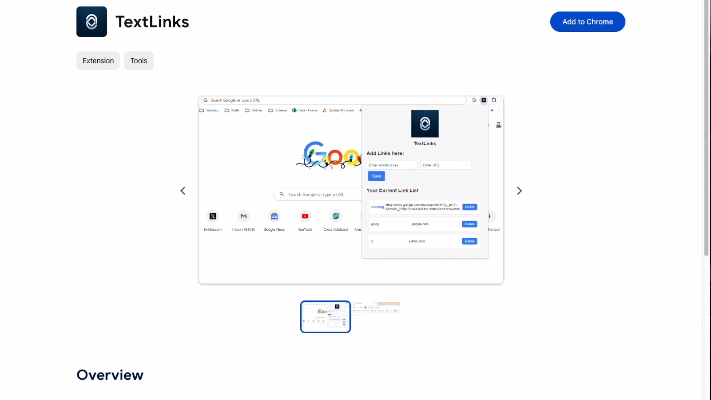

# The TextLinks Chrome Extension


A Chrome extension for text links, triggered by "go", spacebar or tab, and then the
text keyword you've set up. Be sure to pin the extension to your extension bar,
and click the TextLinks logo.





## Technical notes

To see the data in storage:
```
chrome.storage.sync.get(null, function(data) { console.log(data); });
```

To see just keysCache:
```
chrome.storage.sync.get('keysCache', function(data) { console.log(data); });
```


To clear all storage:
```
chrome.storage.sync.clear(function() {
    console.log('All data cleared.');
});
```
